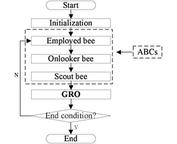
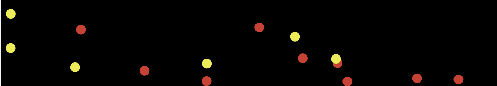

# Artificial Bee Colony (ABC) Optimization

An end-to-end implementation and simulation of the **Artificial Bee Colony (ABC)** swarm intelligence algorithm applied to a 4-dimensional complex non-linear objective function (**Ackley Function**).

## Features
- **Dual Optimization:** Full modular code supporting both **Minimization** and **Maximization**.
- **Swarm Simulation:** Agent-based visual simulation developed using **NetLogo Web** to monitor Employed, Onlooker, and Scout bees behavior dynamically.
- **Mathematical Benchmark:** Optimizes a 4-variable constraint matrix bounded between $[-5.0, 5.0]$.

## Parameters
- Colony Size: 30
- Limit: 20
- Max Iterations: 50

